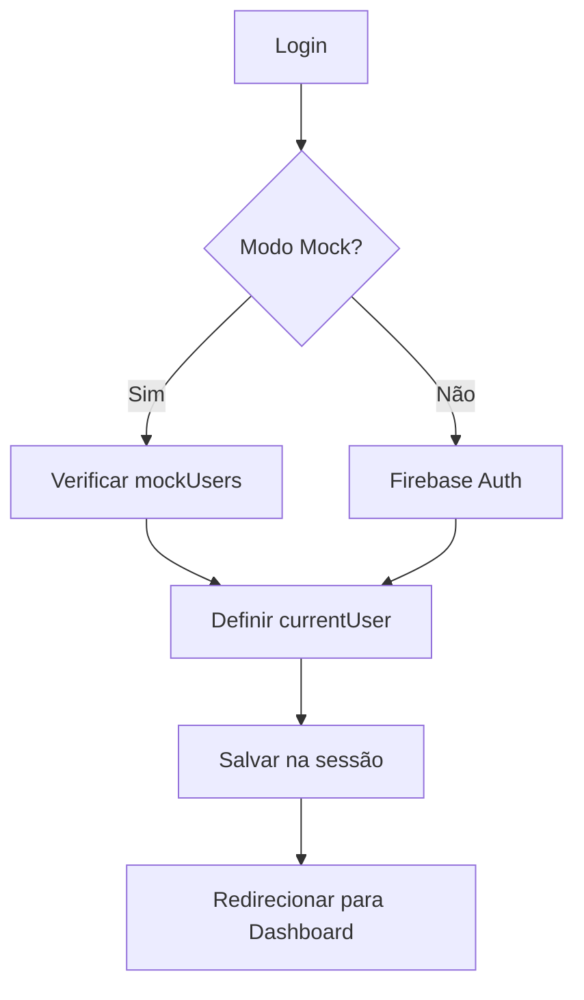
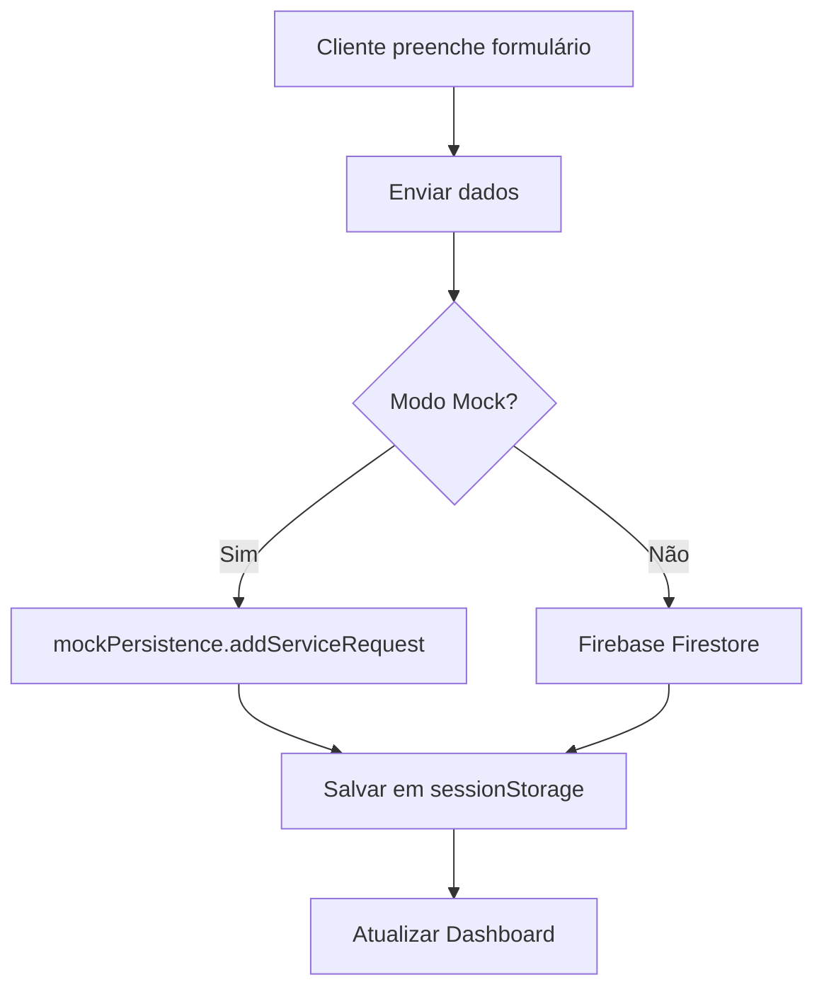
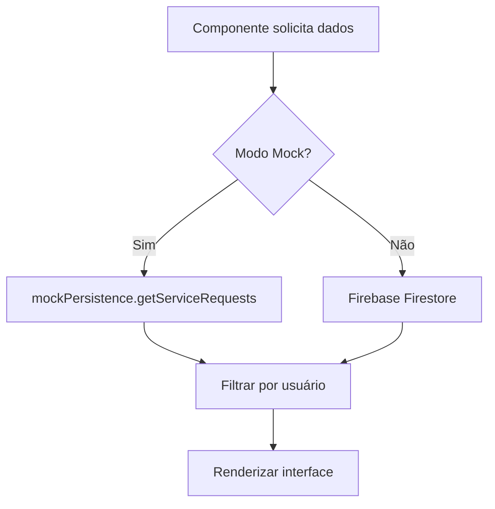

# 🔧 Sistema de Solicitações Mock - SSX Solar

## 📋 Visão Geral

Este documento descreve o sistema de solicitações mockadas implementado para o projeto SSX Solar. O sistema foi projetado para funcionar perfeitamente com dados simulados durante o desenvolvimento, mantendo total compatibilidade para migração futura para Firebase real.

## 🎯 Objetivos

1. **Funcionalidade Completa**: Sistema totalmente funcional para testes e desenvolvimento
2. **Persistência de Sessão**: Dados mantidos durante toda a sessão do navegador
3. **Compatibilidade Firebase**: Estrutura idêntica ao que será usado no Firebase
4. **Facilidade de Migração**: Transição transparente para dados reais

## 🏗️ Arquitetura do Sistema

### Componentes Principais

#### 1. **AuthContext** (`src/contexts/AuthContext.jsx`)
- Gerencia autenticação mock e real
- Usuários de teste predefinidos
- Persistência de sessão automática

#### 2. **MockPersistence** (`src/services/mockPersistence.js`)
- Sistema de persistência em `sessionStorage`
- Simula banco de dados local
- Dados estruturados como no Firestore

#### 3. **ServiceRequests Service** (`src/services/serviceRequests.js`)
- Interface unificada para dados mock/real
- Fallbacks automáticos em caso de erro
- Compatibilidade total com Firebase

#### 4. **TestUsers Component** (`src/components/dev/TestUsers.jsx`)
- Interface para alternar entre usuários
- Facilita testes de diferentes roles
- Visível apenas em modo desenvolvimento

## 👥 Usuários de Teste

### Cliente Teste
- **Email**: `cliente@ssxsolar.com`
- **Senha**: `123456`
- **Role**: `client`
- **UID**: `client-123`
- **Funcionalidades**: Criar e acompanhar solicitações

### Instalador Teste
- **Email**: `instalador@ssxsolar.com`
- **Senha**: `123456`
- **Role**: `installer`
- **UID**: `installer-123`
- **Funcionalidades**: Gerenciar serviços atribuídos

### Administrador Teste
- **Email**: `admin@ssxsolar.com`
- **Senha**: `123456`
- **Role**: `admin`
- **UID**: `admin-123`
- **Funcionalidades**: Acesso total ao sistema

## 📊 Dados Mock Incluídos

### Solicitações de Serviço
- **5 solicitações predefinidas** com diferentes status
- **Dados realistas**: Endereços, datas, prioridades
- **Relacionamentos**: Cliente → Instalador → Admin
- **Status diversos**: pending, in_progress, completed, etc.

### Estrutura de Dados
```javascript
{
  id: 'req-001',
  clientId: 'client-123',
  clientName: 'Cliente Teste',
  clientEmail: 'cliente@ssxsolar.com',
  equipmentType: 'solar_heater',
  productId: 'prod-001',
  status: 'pending',
  address: {
    street: 'Rua das Flores',
    number: '123',
    complement: 'Apto 45',
    neighborhood: 'Vila Madalena',
    city: 'São Paulo',
    state: 'SP',
    zipCode: '05427-001'
  },
  notes: 'Observações do cliente',
  priority: 'normal',
  createdAt: { seconds: timestamp },
  updatedAt: { seconds: timestamp }
}
```

## 🔄 Fluxo de Funcionamento

### 1. **Login de Usuário**


### 2. **Criação de Solicitação**


### 3. **Visualização de Dados**


## 🎮 Como Testar o Sistema

### 1. **Acesso ao Sistema**
1. Execute `npm run dev`
2. Acesse `http://localhost:5173`
3. Use o componente **TestUsers** no dashboard

### 2. **Teste de Cliente**
1. Faça login como cliente
2. Crie nova solicitação em "Solicitar Serviço"
3. Visualize histórico em "Histórico de Serviços"
4. Dados persistem durante a sessão

### 3. **Teste de Instalador**
1. Faça login como instalador
2. Visualize serviços atribuídos
3. Teste alteração de status

### 4. **Teste de Admin**
1. Faça login como admin
2. Visualize todas as solicitações
3. Teste gestão de usuários

## 🔧 Configurações de Desenvolvimento

### Modo Mock vs Firebase
- **Detectado automaticamente** por `isDevelopmentMode()`
- **Baseado na presença** de configuração Firebase
- **Logs informativos** para debugging

### Persistência de Dados
- **SessionStorage**: Dados mantidos durante sessão
- **Estrutura idêntica** ao Firestore
- **Reset automático**: Novos dados a cada sessão

### Debugging
```javascript
// Logs automáticos em desenvolvimento
console.log('🔧 [DEV MODE] ...');
console.log('📋 [DEV MODE] ...');
console.log('✅ [DEV MODE] ...');
```

## 🚀 Migração para Firebase Real

### Preparação
1. Configure Firebase no projeto
2. Execute `npm run firebase:prod`
3. Sistema detecta automaticamente

### Transferência de Dados
```javascript
// Exportar dados mock
const mockData = mockPersistence.exportData();

// Importar para Firebase (implementar)
await migrateToFirebase(mockData);
```

### Compatibilidade
- **Estrutura idêntica** de dados
- **APIs compatíveis** entre mock/real
- **Sem alteração** de código da interface

## 🛠️ Desenvolvimento e Manutenção

### Adicionar Novos Usuários Mock
```javascript
// Em mockPersistence.js
const newUser = {
  id: 'user-456',
  uid: 'user-456',
  email: 'novo@usuario.com',
  role: 'client',
  // ... outros campos
};
```

### Adicionar Novos Dados Mock
```javascript
// Em mockPersistence.js
const newRequest = {
  id: 'req-006',
  clientId: 'client-456',
  // ... outros campos
};
```

### Extensão do Sistema
- **Novos campos**: Adicionar em ambos mock e Firebase
- **Novas funcionalidades**: Implementar para ambos modos
- **Testes**: Usar dados mock para desenvolvimento

## ✅ Funcionalidades Implementadas

### ✅ Autenticação
- [x] Login/logout mock
- [x] Persistência de sessão
- [x] Alternância entre usuários
- [x] Roles e permissões

### ✅ Solicitações de Serviço
- [x] Criação de solicitações
- [x] Listagem por cliente
- [x] Listagem por instalador
- [x] Listagem completa (admin)
- [x] Atualização de status
- [x] Atribuição de instaladores

### ✅ Interface
- [x] Dashboard do cliente
- [x] Histórico de serviços
- [x] Formulário de solicitação
- [x] Componente de teste
- [x] Filtros e busca

### ✅ Persistência
- [x] Dados mantidos na sessão
- [x] Estrutura compatível com Firebase
- [x] Fallbacks automáticos
- [x] Logs de debugging

## 🎯 Próximos Passos

### Funcionalidades Pendentes
- [ ] Dashboard do instalador
- [ ] Dashboard do admin
- [ ] Detalhes de solicitação
- [ ] Upload de imagens (mock)
- [ ] Notificações

### Melhorias
- [ ] Paginação de dados
- [ ] Cache inteligente
- [ ] Sincronização offline
- [ ] Exportação de relatórios

## 📝 Notas Importantes

1. **Dados temporários**: Dados mock são perdidos ao fechar o navegador
2. **Desenvolvimento apenas**: Sistema mock só funciona em modo desenvolvimento
3. **Compatibilidade**: Estrutura 100% compatível com Firebase
4. **Performance**: Sistema otimizado para desenvolvimento rápido

## 🐛 Resolução de Problemas

### Dados não persistem
- Verificar se sessionStorage está funcionando
- Checar console para erros de serialização

### Login não funciona
- Verificar credenciais mock (email/senha)
- Checar se está em modo desenvolvimento

### Componentes não carregam
- Verificar imports
- Checar se usuário está logado
- Verificar role do usuário

---

**Sistema implementado com sucesso! 🎉**

Todas as funcionalidades básicas estão funcionando perfeitamente com dados mock persistentes, prontas para migração futura ao Firebase real. 